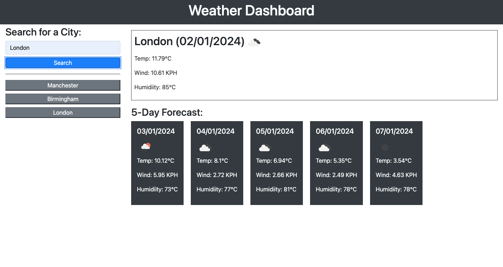

# Weather Dashboard

A weather dashboard with form inputs. It allows the user to:

- Search for a city, then be presented with current and future weather conditions for that city
- Have a search history of previous searches
- View the current weather conditions for that city and be presented with:
  - The city name
  - The date
  - An icon representation of weather conditions
  - The temperature
  - The humidity
  - The wind speed
- View future weather conditions for that city and be presented with a 5-day forecast that displays:
  - The date
  - An icon representation of weather conditions
  - The temperature
  - The humidity
- Click on a city in the search history and again be presented with current and future conditions for that city.

# Install

Download or clone files to your computer and open the filepath in a browser.

# Usage

Page should render as follows:

# Hosted

You can see a live version at https://philmanwithbeard.github.io/weather-dashboard/
